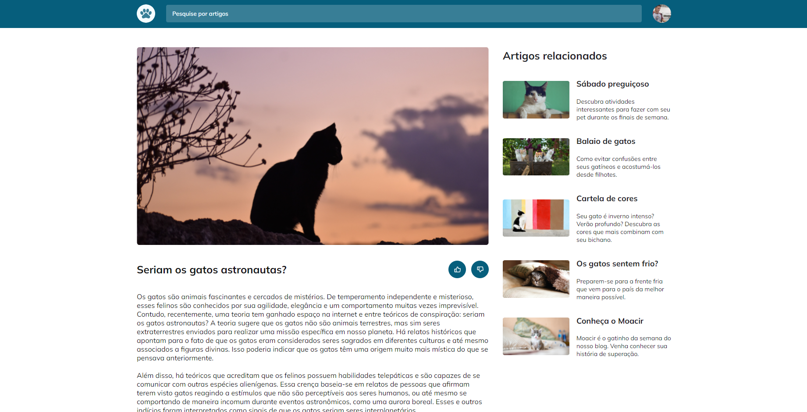
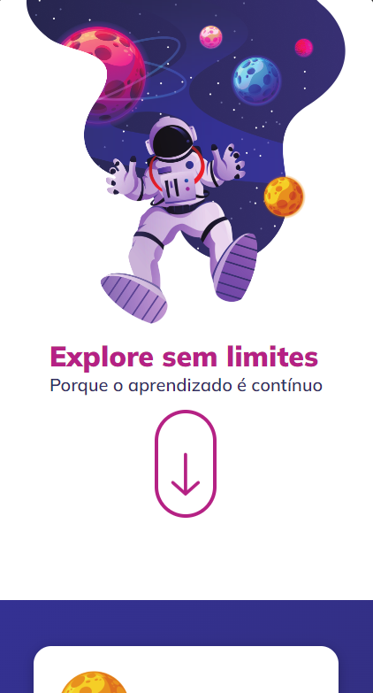
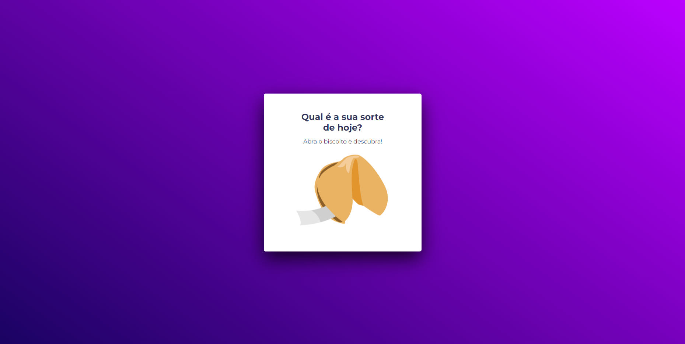
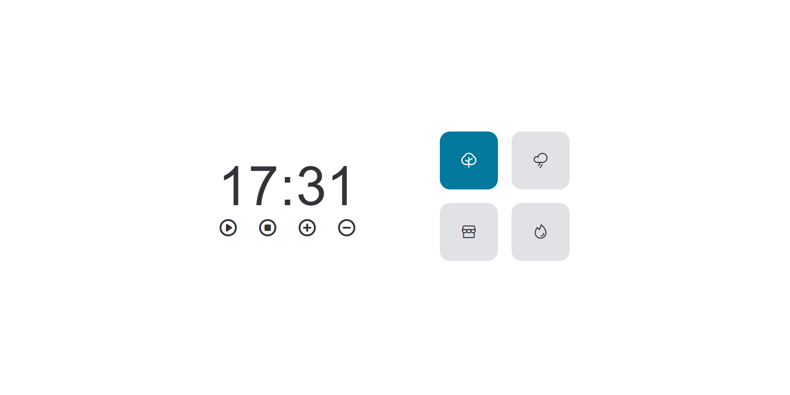
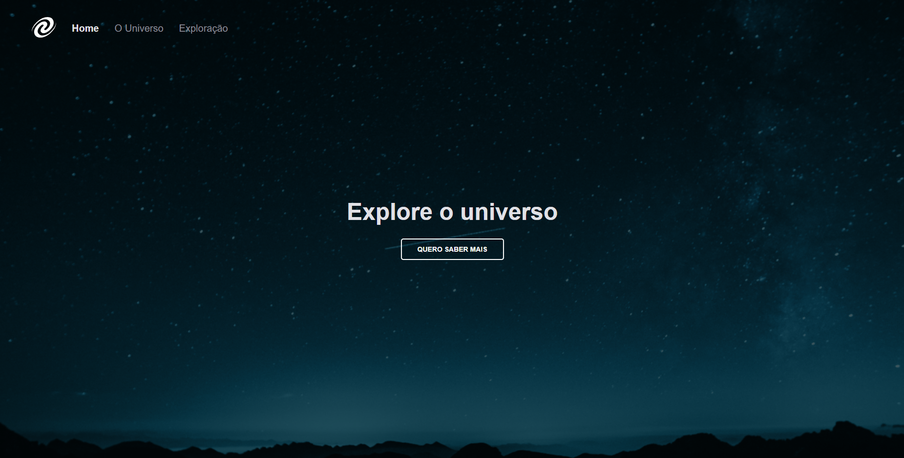
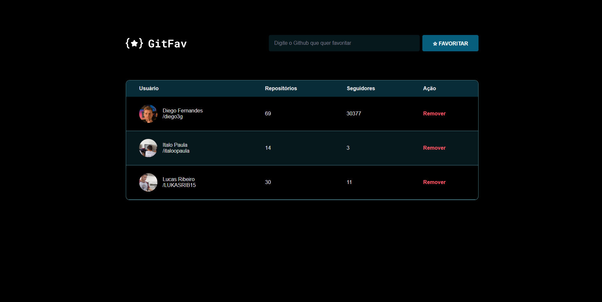
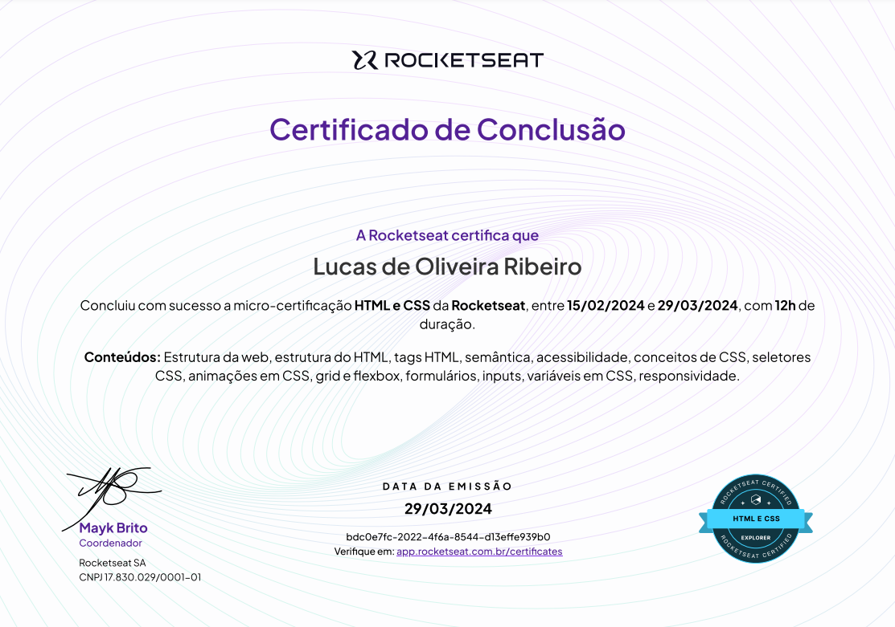

# Projetos do Explorer 🚀

Esse repositório terá contido todos os projetos e desafios desenvolvidos durante a trilha Explorer da Rocketseat, onde estou adquirindo conhecimento fundamental sobre desenvolvimento web. Nesse respositório terá projetos fundamentais de HTML e CSS até os mais avançados contendo JS e frameworks. 

## Tecnologias

- HTML
- CSS
- JavaScript
- Git e Github
- Figma

## Blog de gatos
Esse projeto funciona como um landing page de um blog sobre gatos, a ideia dele é focada em pontos principais no desenvolvimento web como <strong>acessibilidade</strong>, <strong>responsividade</strong> e melhores <strong>animações</strong> com CSS.

### Ferramentas

 
  

  

 

## Explore sem limites
Esse projeto é inspirado em landing pages muito utilizadas em muitos sites.A ideia dele é focada em pontos principais no desenvolvimento web e funcionou como revisão sobre as tecnologias. Principais características focadas foi <strong>acessibilidade</strong>, <strong>responsividade</strong>, melhores <strong>animações</strong> com CSS e uso de <strong>formulários</strong>.

### Ferramentas

 
  

  

  

 

  

## Biscoito da sorte
Projeto onde adquiri meus primeiros contatos fundamentais com Java Script, onde aprendi sobre a DOM e alguns conhecimentos sobre eventos e submissões. Além disso, utilizei ainda mais animações com CSS durante esse projeto.

### Ferramentas

 
  

  

  

 

  

## Técnica Pomodoro
Nesse projeto foi desenvolvido um site onde o usuário pode cronometrar o tempo durante seus estudos acompanhado de um áudio de fundo para ajudar na concentração. Nesse projeto, comecei a utilizar o JavaScript de forma mais profissional, usando import/export para importar e exportar funções de arquivos JavaScript, buscando melhorar a estruturação dos dados, foi o começo dos meus estudos na introdução de áudios em sites e aprendizado aprofundado sobre acessibilidade.

### Ferramentas

 
  

  

  

 

  

## SPA Universe
Projeto focado em criação de rotas e navegação com JavaScript e introduzimos o conhecimento sobre single page application (SPA). Nesse projeto também utilizamos import/export e criamos classes para melhor organização do código.

### Ferramentas

 
  

  

  

 

  

## Github Favorites
Nesse projeto foi introduzido, além do conhecimento sobre SPA, o conhecimento sobre consumo de API, o uso de orientação a objeto em JavaScript e a programação assíncrona.

### Ferramentas

 
  

  

  

 

  

 

# Certificados 👨‍💻

Aqui mostrarei meus micro-certificados adquiridos durante esse processo de estudos no Explorer até atingir a meta que é o certificado de especialista nessas ferramentas.

## HTML e CSS 

  

## JavaScript 

  

